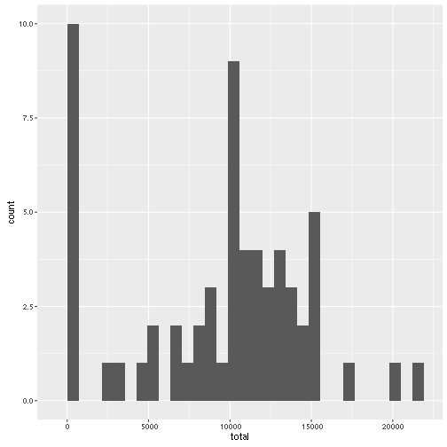
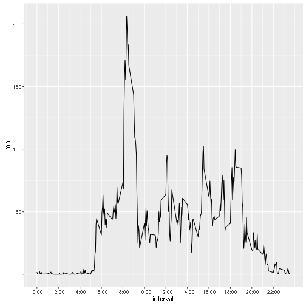
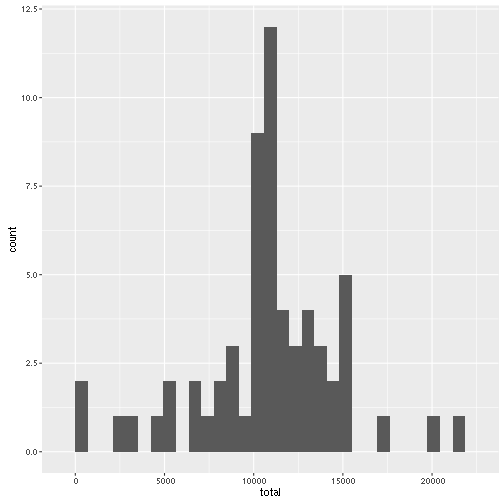
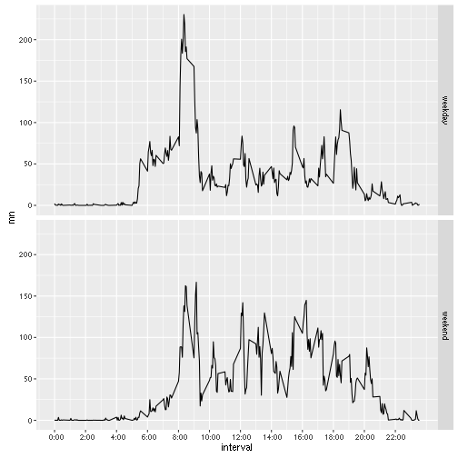

# RepData

## Loading and preprocessing the data

```r
download.file(url="http://d396qusza40orc.cloudfront.net/repdata%2Fdata%2Factivity.zip",
              destfile="repdata data activity.zip")
unzip(zipfile="repdata data activity.zip")

data <- read.csv(file="activity.csv")
data$date <- as.Date(data$date, format="%Y-%m-%d")
data$hour <- as.factor(data$interval)
levels(data$hour) <- sprintf("%2d:%s", rep(0:23,each=12), 
                             rep(c("00","05",seq(10,55,5)),24))
data$time <- strptime(paste(data$date,data$hour), format="%Y-%m-%d %H:%M")
```

## What is mean total number of steps taken per day?

```r
library(dplyr)
data_day <- data %>% select(steps, date) %>% group_by(date) %>%
  summarise(total=sum(steps,na.rm=T))
data_day_summ <- data_day %>% summarise(mn=mean(total), md=median(total))
```

The histogram of the total number of steps taken per day

```r
library(ggplot2)
ggplot(data_day, aes(x=total)) + geom_histogram()
```

```
## `stat_bin()` using `bins = 30`. Pick better value with `binwidth`.
```

 

The mean of total number of steps taken per day is 9354.23 and the median is 10395.

## What is the average daily activity pattern?

```r
data_interval <- data %>% select(steps, interval, hour) %>% 
  group_by(interval, hour) %>% summarise(mn=mean(steps, na.rm=T))
ggplot(data_interval, aes(x=interval, y=mn)) + geom_line() + 
  scale_x_continuous(breaks=data_interval$interval[seq(1,288,24)],
                     labels=data_interval$hour[seq(1,288,24)])
```

 

```r
int_max <- as.character(data_interval$hour[which.max(data_interval$mn)])
```

The interval  8:35 contains the maximum number of steps.

## Imputing missing values

```r
num_mis <- sum(is.na(data$steps))
```
The total number of 2304.

We impute with the mean of each interval across all days.

```r
data_imp <- data %>% select(-time) %>% left_join(data_interval)
```

```
## Joining by: c("interval", "hour")
```

```r
data_imp$steps[is.na(data_imp$steps)] <- data_imp$mn[is.na(data_imp$steps)]
```

The total number of steps per day for the imputed dataset.

```r
data_day_imp <- data_imp %>% select(steps, date) %>% group_by(date) %>%
  summarise(total=sum(steps,na.rm=T))
data_day_imp_summ <- data_day_imp %>% summarise(mn=mean(total), md=median(total))
```

The histogram of the total number of steps taken per day for the imputed dataset.

```r
ggplot(data_day_imp, aes(x=total)) + geom_histogram()
```

```
## `stat_bin()` using `bins = 30`. Pick better value with `binwidth`.
```

 

The mean of total number of steps taken per day is 1.076619 &times; 10<sup>4</sup> and the median is 1.0766189 &times; 10<sup>4</sup>.

## Are there differences in activity patterns between weekdays and weekends?

```r
data_imp$type_day <- ifelse(weekdays(data_imp$date) %in% c("Saturday","Sunday"),
                            "weekend", "weekday")
data_imp$type_day <- as.factor(data_imp$type_day)
data_imp_interval <- data_imp %>% select(steps, interval, hour, type_day) %>% 
  group_by(type_day, interval, hour) %>% summarise(mn=mean(steps, na.rm=T))
ggplot(data_imp_interval, aes(x=interval, y=mn)) + geom_line() + 
  scale_x_continuous(breaks=data_interval$interval[seq(1,288,24)],
                     labels=data_interval$hour[seq(1,288,24)]) +
  facet_grid(type_day ~ .)
```

 

